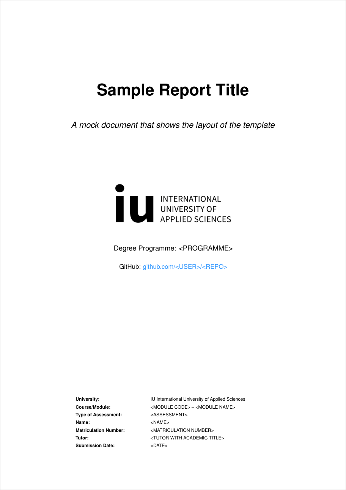
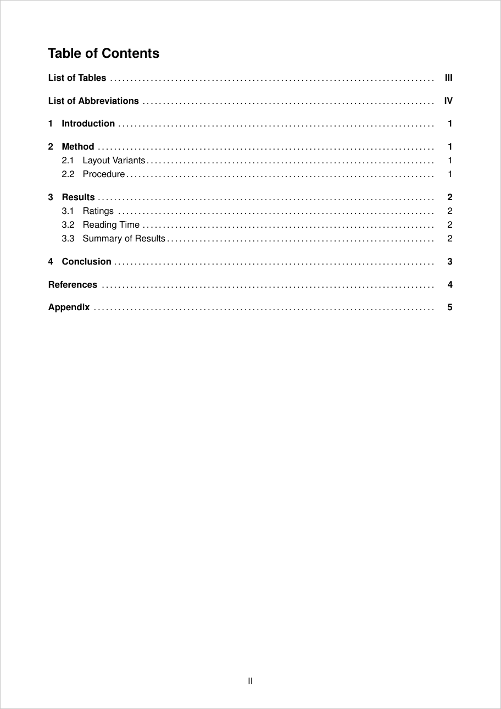
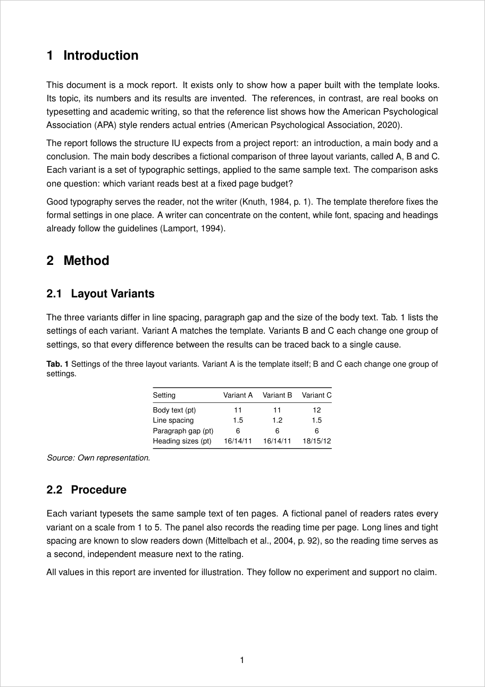
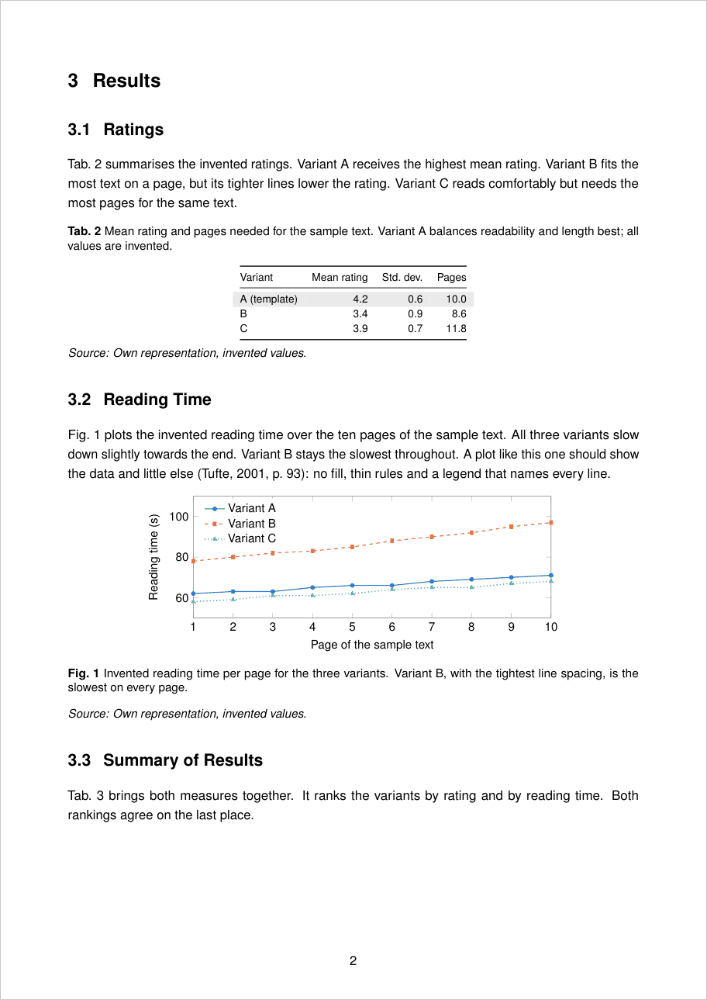
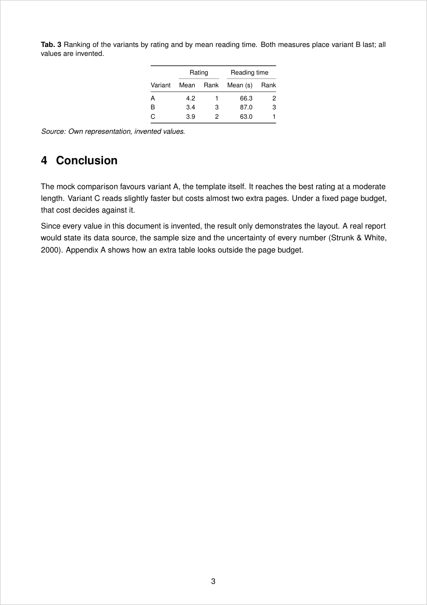
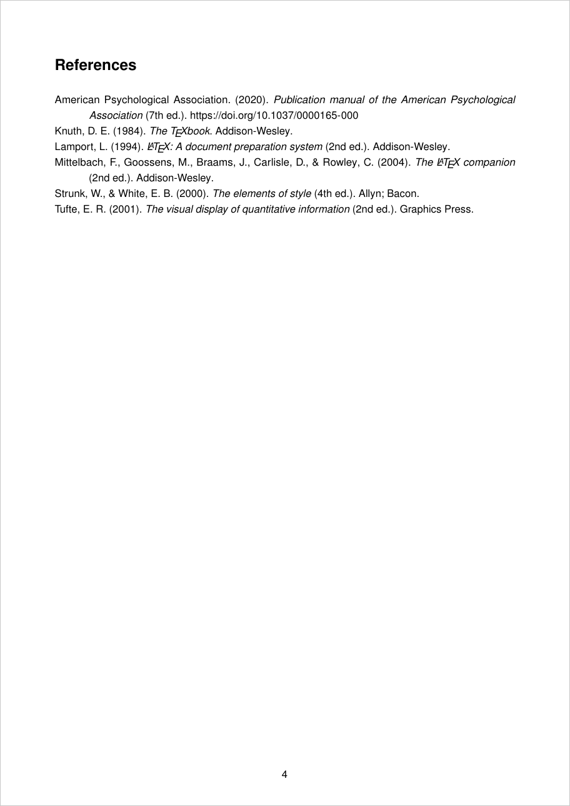

# LaTeX Template for IU Assignments

A LaTeX template for written assignments and project reports at IU International University of
Applied Sciences. The layout follows the IU formatting guidelines, so a new paper starts with the
formal requirements already met.

The template is built for my own use and grows with every assignment. It is public, so feel free
to clone, reuse or adapt it.

## Preview

Pages from a mock report built with the template. Topic, text and numbers are invented; the
references are real books on typesetting and writing. The source is in
[`example/`](example/example.tex).

<table>
  <tr>
    <td width="33%"></td>
    <td width="33%"></td>
    <td width="33%"></td>
  </tr>
  <tr>
    <td align="center">Title page</td>
    <td align="center">Table of contents</td>
    <td align="center">Headings, body text, table</td>
  </tr>
  <tr>
    <td width="33%"></td>
    <td width="33%"></td>
    <td width="33%"></td>
  </tr>
  <tr>
    <td align="center">Table and plot</td>
    <td align="center">Table with grouped columns</td>
    <td align="center">APA reference list</td>
  </tr>
</table>

## What is set up

**Layout**

- DIN A4, single-sided, 2 cm margins on all sides
- Arial 11 pt (Helvetica), maths in the same sans-serif font
- 1.5 line spacing, justified text, hyphenation on, 6 pt between paragraphs
- Bold headings at 16 / 14 / 11 pt, three levels at most
- No orphans, no widows, no heading stranded at the foot of a page
- Footnotes in 10 pt with a hanging number
- Centred page numbers: Roman for the front matter, hidden on the title page, Arabic from the
  introduction on

**Front matter**

- Title page with every field IU asks for
- Table of contents with only level 1 in bold
- Lists of figures, tables and abbreviations, and a glossary, ready to switch on

**Citations, figures and tables**

- APA 7 via `biblatex` and `biber`, hanging indent of 1.27 cm in the reference list
- Floats labelled "Fig." and "Tab." as in the IU samples
- `\srcnote{...}` for the 10 pt source line every float needs
- `\tablefontsize` for compact tables inside floats
- `listings` set up for source code in the appendix, `tikz` and `pgfplots` for diagrams

**Review marks**

| Command | Effect |
| --- | --- |
| `\rev{text}` | Highlights a span, e.g. a number not measured yet |
| `\revn{text}{note}` | Highlight plus a visible note |
| `\revcite{key}` | Highlights a citation that still needs checking |
| `\revsug{text}` | Shows a suggested rewording behind the original |
| `\revbad{note}` | Red mark for a claim without a source |

`\reviewfalse` in the preamble removes every mark at once and leaves the text untouched.

## Usage

```bash
git clone https://github.com/l-lattermann/LaTex-Template--Uni-Assignments.git my-assignment
cd my-assignment
cp template.tex YYYYMMDD_firstname_surname_matriculationnumber_coursecode.tex
latexmk -pdf YYYYMMDD_firstname_surname_matriculationnumber_coursecode.tex
```

Then:

1. Fill in the `<PLACEHOLDERS>` on the title page.
2. Put the chapters in `sections/` and `\input` them where marked.
3. Put the sources in `references.bib`.
4. Uncomment the lists the paper needs. IU asks for a list of figures or tables from three on.
5. Set `\reviewfalse` before building the final PDF.

`latexmk` sends all intermediate files to `build/`. `latexmk -C` cleans up.

## Requirements

A current TeX distribution with `biber`, e.g. TeX Live or MacTeX. Turnitin has trouble with PDFs
from outdated distributions.

On Apple Silicon, `biber` can fail to unpack itself. `.latexmkrc` then uses a thinned copy at
`~/bin/biber-arm64`, if one exists.

## What is not in this repository

The `.gitignore` keeps out everything that belongs to a specific assignment: `sections/`,
`references.bib`, literature, compiled PDFs and submission files. This repository holds the
template, not the papers written with it. The only exception is the mock report in `example/`.
